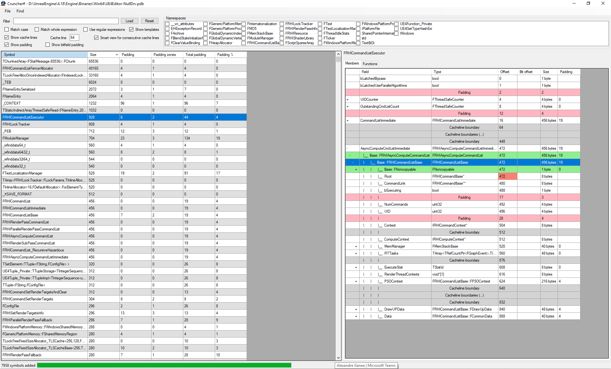

# crunchersharp
Program analyses debugger information file (PDB, so Microsoft Visual C++ only) and presents info about user defined structures (size, padding, cachelines, functions etc). 

- You can filter by namespace, search for a specific symbol
- You can import a .csv with the instance count to get the total waste, the format should be "Class Name, Number of instances"
- You can compare two PDBs
- You search for useless vtables, useless virtual...  

Original blog post: http://msinilo.pl/blog/?p=425

Note that you will need the `msdia` classes to be registered. To do this:

  1) Find the msdia DLL corresponding to the version of the compiler you used to build the application. 
      -- If you have Visual Studio installed, this DLL can be found in "C:\Program Files (x86)\Microsoft Visual Studio <VERSION>\Common7\IDE", where <VERSION> corresponds to your compiler version (e.g. "12.0" for Microsoft Visual Studio 2013)
      -- If you don't have the compiler installed, download the appropriate "Microsoft Visual C++ <VERSION> Redistributable Package" and install it. 
  
  2) Open an elevated (admin) command prompt in the directory containing msdia<VERSION>.dll. 

  3) Manually register the DLL by typing "regsvr32 msdia<VERSION>.dll" (e.g. "regsvr32 msdia12.dll" for Visual Studio 2013)
  

